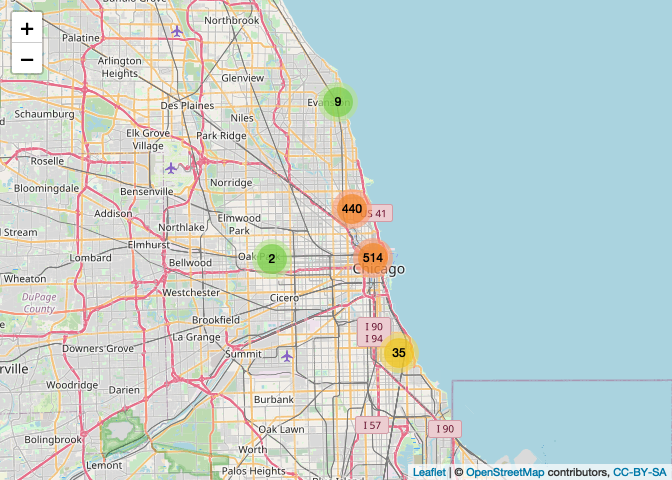

Leaflet
================
Corey Neff
7/5/2021

## R Markdown with Leaflet

### Instructions

1.  Create a web page using R Markdown that features a map created with
    Leaflet.

2.  Host your webpage on either GitHub Pages, RPubs, or NeoCities.

3.  Your webpage must contain the date that you created the document,
    and it must contain a map created with Leaflet. We would love to see
    you show off your creativity!

### Submission

Here I am reading a portion of the “Cyclistic” dataset provided by
Google. This dataset tracks geocoded bike-share rentals in the greater
Chicago area. The full dataset is &gt;600,000 rows, which will make
Leaflet stall, so I am only using a random sample of 1000 for the
visiual. I am also using the AwesomeMarkers plugin that comes with
Leaflet to color code the markers based on whether the person renting
the bike was a member of the program (“<span
style="color: red;">red</span>”) or casual user/not a member (“<span
style="color: green;">green</span>”). Finally, I am using
MarkerClusterOptions() to reduce the amount of markers that can be
loaded at once to increase load times.

``` r
librarian::shelf(leaflet, dplyr, ggplot2)
set.seed(69)

mydata <- read.csv(file='202008-divvy-tripdata.csv') %>%
      mutate(lat = start_lat,
             lng = start_lng,
             member_casual = as.factor(stringr::str_to_title(member_casual)),
             rideable_type = stringr::str_to_title(rideable_type)) %>%
      select(-c(ride_id, start_station_name, end_station_name, end_lat, end_lng, start_lat, start_lng)) %>%
      sample_n(1000)


getColor <- function(member) {
  sapply(mydata$member_casual, function(member) {
  if(member == "Casual") {
    "green"
  } else {
    "red"
  } })
}

icons <- awesomeIcons(
  icon = 'ios-close',
  iconColor = 'black',
  library = 'ion',
  markerColor = getColor(mydata)
)

mymap <- mydata %>%
      leaflet() %>%
      addTiles() %>%
      addAwesomeMarkers(~lng, ~lat, icon=icons, label=~as.character(member_casual), clusterOptions = markerClusterOptions())
mymap
```

<!-- -->
